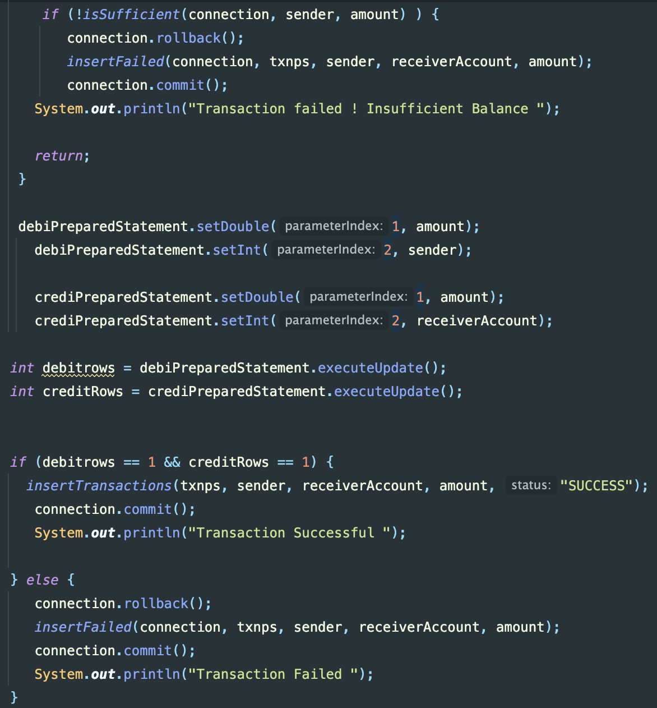

# ☕ Java JDBC Transaction System

A **Java JDBC–based transaction handling system** demonstrating 🔐 **ACID properties**, manual transaction control, ⚠️ deadlock prevention, and 🧾 transaction history logging using MySQL.

---

## 🔐 Configuration (Security)

Database credentials are **not hardcoded** in the source code.

Set the following environment variables before running the application:

```bash
export DB_URL="jdbc:mysql://localhost:3306/banking"
export DB_USERNAME="root123"
export DB_PASSWORD="password321"

---

## ✨ Features
- 💸 Fund transfer between accounts
- 🔄 Manual transaction control (`commit` / `rollback`)
- 🔒 Deadlock prevention using ordered row locking
- 🧾 Transaction history logging (SUCCESS / FAILED)
- 🗄️ MySQL row-level locking with `FOR UPDATE`

---

## 📸 Transaction Flow Implementation

The application uses JDBC transaction management to maintain data consistency and follow ACID principles.

### Transaction Handling

- Manual transaction control using `setAutoCommit(false)`
- Debit and credit operations using `PreparedStatement`
- `commit()` after successful operations
- `rollback()` when any operation fails
- Transaction history logging with SUCCESS / FAILED status





## 🛠️ Technologies Used
- ☕ Java
- 🔌 JDBC
- 🐬 MySQL
- 📄 SQL Transactions

---

## ⚙️ How It Works
1. 🧪 Validates sender and receiver accounts  
2. 🔐 Locks rows in fixed order to prevent deadlocks  
3. 💰 Checks sufficient balance  
4. 🔁 Performs debit & credit in a single transaction  
5. ✅ Commits on success, ❌ rolls back on failure  
6. 🧾 Logs transaction history  

---

## 🎯 Learning Outcomes
- 🧠 JDBC transaction management
- 🔒 Deadlock prevention strategy
- 🏦 Real-world banking consistency handling
- 📊 Reliable error handling & rollback logic

---

## 👤 Author
**Ashwin**

